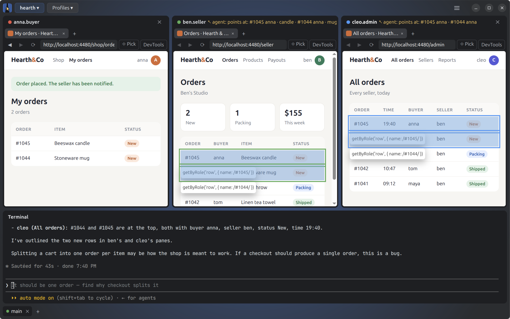

# Kulisa



**Your AI agent builds, checks the result as every user, fixes, and goes again until it works. Watch every step, or
take a break.**

Kulisa is a desktop app where the agent you choose (Claude Code, Codex) works in your signed-in browser profiles, side
by side. It is made for developing web apps with several users at once, and good for any work in web apps. Each
**profile** is an embedded browser profile, as in Chrome (cookies, storage, tabs). You sign in by hand in a profile's
pane, never the agent; the agent runs in the built-in terminal and drives the profiles through Kulisa's MCP server. Point at an element (Pick; Pick again or Esc cancels): a reference
with a locator the agent can act on lands in its prompt, and you write the rest of the message around it.

Website: [kulisa.app](https://kulisa.app). The product and its decisions: [docs/SPEC.md](docs/SPEC.md); how it works: [docs/profiles.md](docs/profiles.md),
[docs/workspaces.md](docs/workspaces.md), [docs/window.md](docs/window.md); plans: [docs/ROADMAP.md](docs/ROADMAP.md);
how the design was tested: [docs/REPORT.md](docs/REPORT.md).

## Run

```sh
npm install          # Node 22.13+. Rebuilds node-pty for Electron.
npm start            # opens the windows and projects open last; at first start the Welcome screen
KULISA_PROJECT=~/my-app npm start
npm test             # starts the real app against a local test site, then again to check a restart
npm run package      # the app for this platform, in out/
npm run make         # installers for this platform, in out/make/ (.deb on Linux, .exe on Windows, .dmg/.zip on macOS)
npm run icons        # after changing assets/icon.svg: icon.png, .ico, .icns next to it
```

Kulisa targets macOS, Windows and Linux; so far it is tested on Ubuntu only (see docs/ROADMAP.md). Installers are
built with [Electron Forge](https://www.electronforge.io/) (`forge.config.js`), each on its own platform.

`npm start` and `npm test` run Electron with `--no-sandbox`: on Linux `chrome-sandbox` in `node_modules` is not
setuid on a plain install. The `.deb` installs it setuid, so the installed app runs sandboxed.

| Variable | Effect |
|---|---|
| `KULISA_PROJECT` | Open the project in this folder (added if new). The agent of its main workspace runs there |
| `KULISA_AGENT` | One agent command for every workspace, without asking (e.g. a CLI Kulisa does not know). It gets no Claude Code plugin; its workspace's MCP URL is in its environment as `KULISA_MCP_URL`, with `KULISA_PORT_OFFSET` and `KULISA_WORKSPACE` |
| `KULISA_MIMIC=0` | Do not present profiles as Google Chrome |
| `KULISA_SIGNIN_HOSTS` | More sign-in hosts for the automatic sign-in pause, comma-separated |
| `KULISA_DATA` | Data folder instead of `~/.config/Kulisa` (e.g. to try a build next to your real one) |
| `KULISA_MCP_PORT` | MCP server port (default 4450; `0` picks a free one) |
| `KULISA_SHOT` | Save a screenshot of the whole window to this PNG file ~4 s after start (`KULISA_SHOT_DELAY`, ms) |

**Projects:** a project is a folder, usually a repository, with its own profiles, grid and agent. The bar under the
grid (or over it: **☰ → Projects bar**) has an island per open project, as apps in a dock: its name, then its
workspaces. A click on a workspace shows it, of any project, and the others keep running (their agents and pages)
until you close their project (**×** on its main, the middle button on its name, or **Close Project** in its
right-click menu, after a question; closing a window asks once for all its projects). The button after the islands opens a menu of the
projects: open another one (in this window or in a new window: Kulisa asks), remove one (its **×** on hover:
Kulisa's data of it and its forks; its folder stays), **New Project…** (a name and where its folder goes, your home
folder by default; git on by default), **Open Folder…**, close the project. Closing the last project shows the
Welcome screen. A closed project keeps its tabs and
sign-ins; when you open it again, its agent continues the conversation where it can (`claude --resume`,
`codex resume`). The agent starts in your shell in the project's folder, as if you typed its command in a
terminal there, so the project's environment (direnv's `.envrc`, nvm, mise) applies; when it exits, the shell stays.

**The agent:** the first time a workspace starts, Kulisa asks which agent to run there: Claude Code, Codex, or
the terminal only. One that is not installed gets an **Install** button (Kulisa runs its maker's installer); on its
first start the agent asks you to sign in to it. Each workspace keeps its choice; **Change agent…** in the
terminal's right-click menu picks another (with a new conversation). **☰ → Agents…** (also on the Welcome screen)
shows at any time which agents are installed, their versions and folders, and installs the others.

**Workspaces:** several tasks of a project at once, each with its own agent, in its project's island: **main** is
the project itself; **+** makes a fork of it with a name you give: a git worktree
on a branch of its own next to the project (`~/IdeaProjects/myshop@checkout/`; `.env*` and files named in
`.worktreeinclude` are copied), copies of main's profiles, still signed in, and a new agent session started there.
The fork's app runs on its own ports: the usual ones plus `KULISA_PORT_OFFSET` (100, 200, …), and the fork's tabs
on local addresses point there. Click a workspace to switch; the others keep working. **×** on a fork deletes it
(its folder, branch, profile copies and conversation), after a question that says what goes and any work not in
main; **×** on main closes the project. Workspaces need git and a first commit: until then a project has no **+**.

Panes and the terminal are panels: drag one by its header to another place (or onto another panel to stack them as
tabs), drag the gaps between them to resize; **☰ → Arrange panels** offers ready-made arrangements, each drawn as a picture. The grid is
kept across restarts. Profiles are added, renamed, described (who each one is in your app: the agent chooses profiles by it, and asks you when it is not said), given another picture and deleted in **👥 → Manage Profiles…** (👥 with the number of open profiles is on the shown workspace's tab, at the bottom), or by right-clicking a pane's header
(a name can also be renamed by double-clicking it). **×** at the top right of a profile's pane closes it: its tabs
go and free their memory, it stays signed in; **👥** lists it as closed and brings it back with the same tabs. Right-click a tab or the terminal for their menus. **Zoom:**
Ctrl + / Ctrl − / Ctrl 0 outside the pages, or ☰ in the title bar, zooms all of Kulisa, and the pages follow; when it
is not 100%, the title bar shows it (click to reset). The same keys in a page zoom that site in that profile on top of it (shown in the address bar,
click to reset). Both are kept across restarts. **☰ → Theme**: Dark (the default), Light, or System (as your OS); profiles' pages keep your OS's. **☰ → Exit** quits
(on macOS Cmd+Q); the windows and their projects open again at the next start. **⋮ → DevTools** on a pane (or F12, Ctrl+Shift+I in its page) opens the DevTools of its active tab. Kulisa's own DevTools
(F12 outside the pages) exist only when running from source (`npm start`), not in a packaged build. Data
(profiles with your sign-ins) lives in `~/.config/Kulisa`.

## Code

```
src/main/        Electron main process
  index.js         entry: reads the environment, calls app.start()
  app.js           the app: windows, open projects (open, close, move to a new window), agents, IPC, quit
  window.js        a window: its open projects and what it shows, its questions
  projects.js      an open project: its workspaces; making and deleting a fork; removing a project's data
  names.js         the one rule for names of projects, workspaces and profiles; slugs for ids and folders
  workspaces.js    a workspace: its profiles, agent (terminal, environment) and folder; a fork's copies of the profiles
  agents.js        the agent CLIs to choose from: how to find, install, start and resume each
  worktrees.js     git for workspaces: worktree and branch of a fork, files outside git copied, changes, removal
  project-profiles.js  a workspace's profiles in order, open and closed: create, rename, describe, close, open, delete
  avatars.js       the profiles' pictures to choose from (Noto Emoji's, in src/renderer/avatars/)
  profiles.js      a profile: a session on its own folder, tabs (WebContentsView), Playwright connection, sign-in mode
  store.js         projects.json, settings.json (Kulisa zoom, theme, the windows and their tabs); per project in projects/<id>/:
                   workspaces.json, and per workspace <n>/: profiles.json (with sites' zoom), layout.json (the window's
                   grid), agent.json (the session to resume), Profile <k>/ (a Chromium profile, its tabs and session
                   cookies in it).
  cdp-proxy.js     per-profile CDP endpoint over webContents.debugger (no --remote-debugging-port)
  local-only.js    refuses requests from web pages to the MCP server and the proxy (Host, Origin)
  mcp-server.js    MCP tools for the agent, each takes a profile; a URL per workspace (/ws/<project>/<n>/mcp)
  agent-hooks.js   answers for the plugin's hooks (/ws/<project>/<n>/hooks/…: the open profiles, the session; the agent's state)
  mimic-chrome.js  UA, UA-CH headers and userAgentData of Google Chrome
  signin-pages.js  which pages are sign-in pages; what URL to restore instead of one
  signin-pause.js  pauses the agent on sign-in pages (temporary implementation, see docs/REPORT.md)
  session-cookies.js  keeps session cookies across restarts (encrypted with the OS keyring)
  picker.js        point and tell: Playwright pickLocator → a reference (profile, tab, locator) typed into the agent's prompt
  ghost.js         the agent's actions: Playwright's annotations in the page, a caption over the pane
  terminal.js      node-pty running the agent CLI, one per workspace
src/agent/claude-plugin/  the Kulisa plugin for Claude Code: MCP config, the profiles skill, hooks (claude --plugin-dir)
src/preload/     the window's bridge to the main process
src/renderer/    window UI. renderer.js: the grid of panels (dockview), panes, ☰ and right-click menus; parts in their
                 own files: common.js, menu.js (the menus), terminal.js (xterm.js, one per workspace), voice.js
                 (dictation), projects.js, workspaces.js (the workspaces' tabs, the new-workspace dialog),
                 profile-editor.js; ES modules loaded when
                 needed: agent-picker.js (choosing and installing an agent), agents.js (the Agents
                 window), both with agent-list.js, ask.js (questions before deleting or
                 closing), new-project.js (New Project…). Styles: tokens.css, components.css, window.css; the icons are a
                 sprite in index.html (docs/ui.md)
assets/          the app icon: icon.svg (source) and what each OS needs, rendered by scripts/icons.js
test/            run.js (starts the app, runs the files in order), helpers.js, the tests by area (agent.js,
                 profiles.js, window.js, grid.js, zoom-and-closing.js, workspaces.js; restart.js after a restart),
                 fixtures/site.js
```

The experiments behind the design (SPEC section 6, E1–E8) were removed after they answered their questions.
They are in git history at commit `9fe8661`; their results are in docs/REPORT.md.

## License

Kulisa is free software: Copyright (C) 2026 Orudzhali Nagaev, licensed under the GNU General Public License,
version 3 or (at your option) any later version ([LICENSE](LICENSE)). It comes with no warranty.

- **Free.** Kulisa is free to use, at home and at work, and the app on your computer stays free. You pay only for
  the agent you choose (Claude Code, Codex). Paid services may come one day, only for what costs money to run
  (a cloud service), never for what runs on your computer.
- **Forks** are welcome: you may change Kulisa, share it and even charge for copies, but whoever gets your version
  gets its source under the same license, free to share on. No one can close the code.
- **The name and the logo** are not covered by the license: a fork must be called otherwise and not look like the
  official Kulisa.

What the license covers and what it does not (agents, their plugins, MCP servers, extensions, services):
[docs/LICENSING.md](docs/LICENSING.md). Contributing: [CONTRIBUTING.md](CONTRIBUTING.md).
